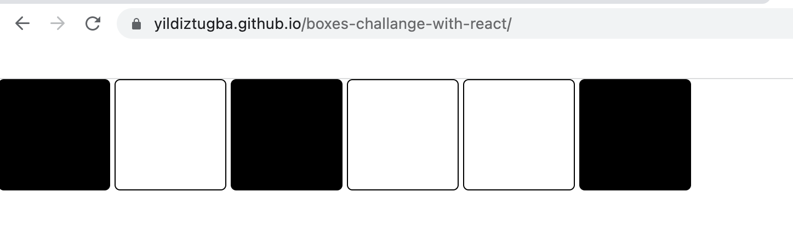

# React Project

## Boxes Challenge

There are six boxes with different background colors (white/black)
The aim is to be able to change color of each box by clicking over them

---

## Overview


## Tools and Technologies

- React
  - state, setState
  - props
  - map
  - toggle
  - component
  - declarative methods
  - call parent methods
  - style prop

### Devops

- Github

## Setup

To run the app, type `npm start` in the CLI.

## Sample React code

Here is a look at how to create a square element by mapping an array of object and calling the box component.

```const squareElements = squares.map(square => (
       <Box 
        key= {square.id}
        
        on = {square.on}
        toggle = {()=>handleClick(square.id)}

       />
    ))
```